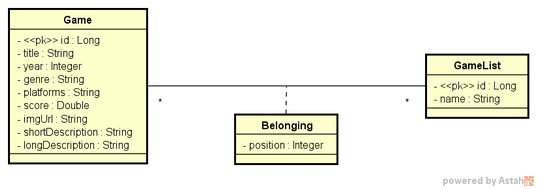
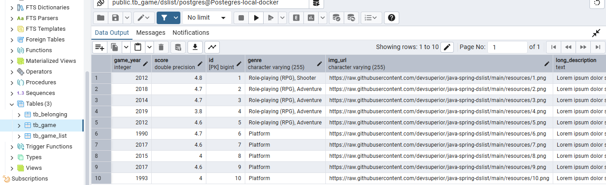

# Game Collection - API
[](https://github.com/LuanaEstevaoDia/dslist/blob/main/LICENSE)


Este projeto foi desenvolvido como parte do curso intensivão Java Spring 19, oferecido pelo DevSuperior. Agradecimentos especiais ao instrutor Nélio Alves e a todos os envolvidos na criação do curso pelos conhecimentos compartilhados e pelo suporte durante as aulas.


## Descrição do Projeto
Este projeto é uma API para gerenciar uma coleção de jogos, permitindo o acesso a todos os jogos disponíveis na coleção, a obtenção de um jogo específico por ID e a alteração da posição do jogo dentro da lista de jogos.

## Diagrama UML




## Conceitos Aprendidos

- **Sistemas web e recursos:** Cliente/servidor, HTTP, JSON
- **Padrão REST para API web**
- **Estruturação de projeto Spring REST**
- **Entidades e ORM**
- **Database seeding**
- **Padrão camadas:** 
- **Padrão DTO**
- **Relacionamentos N-N**
- **Classe de associação com Embedded ID**
- **Consultas SQL no Spring Data JPA**
- **Projections**
- **Ambiente Local com Docker Compose**
- **Processo de homologação local**
- **Processo de deploy com CI/CD**
- **Configuração de CORS**

## Perfis de Projeto

### Desenvolvimento e Testes

Utilizamos o banco de dados H2. As requisições foram feitas utilizando o Postman para garantir a funcionalidade e a integração correta dos endpoints.


### Homologação

Banco de dados Postgres utilizando Docker Compose, PostgreSQL e PgAdmin. E as Requisições foram





### Produção

Banco de dados Postgres de produção utilizando Railway para CI/CD. As requisições foram realizadas utilizando o Postman para validar a produção e assegurar a integridade das funcionalidades. 


## Tecnologias Utilizadas

- **Java** - versão 17
- **Hibernate** 
- **Maven** 
- **Spring Boot** - versão 3.4.1
- **Spring Data JPA** - runtime
- **PostgreSQL** - runtime
- **H2 Database** - runtime
- **Docker** - versão 27.4.0
- **Docker Compose** - versão v2.31.0-desktop.2
- **PgAdmin** - versão 4.30
- **Lombok** - runtime
- **Railway** (para CI/CD) - última atualização: 22/01/2025
- **Git** - versão 2.45.0.windows.1
- **Eclipse IDE** - versão 4.24.0.RELEASE
- **Postman** - versão v11.29.3

## Preparando o Ambiente

### Pré-requisitos

- **Git:** [Como instalar o Git](https://git-scm.com/book/en/v2/Getting-Started-Installing-Git)
- **Docker:** [Instalar Docker](https://www.docker.com/get-started)
- **WSL2:** Necessário para Docker no Windows. [Instalar WSL2](https://docs.microsoft.com/en-us/windows/wsl/install)
- **Docker Compose:** Incluído com Docker Desktop.
- **Java 17:** [Instalar Java 17](https://www.oracle.com/java/technologies/javase-jdk17-downloads.html)
- **Maven:** [Instalar Maven](https://maven.apache.org/install.html)
- **PostgreSQL:** [Instalar PostgreSQL](https://www.postgresql.org/download/)
- **PgAdmin:** [Instalar PgAdmin](https://www.pgadmin.org/download/)

### Passos para Preparar o Ambiente

1. **Instalar o Git, Docker, WSL2, Docker Compose, Java 17, Maven, PostgreSQL e PgAdmin utilizando os links acima.**
2. **Configurar WSL2** se estiver no Windows, conforme as instruções na documentação.

3. **Clonar o repositório:**
**Repositório original do curso:**
     ```bash
    git clone https://github.com/devsuperior/dslist-backend.git

    ```
    **Meu repositório**

    ```bash
    git clone https://github.com/LuanaEstevaoDia/dslist.git
   ````


## Detalhes Técnicos

### Estrutura do Projeto

- `src/main/java`: Contém as classes Java para a aplicação.
- `src/main/resources`: Contém arquivos de configuração.
- `src/test`: Reservados para testes.

### Endpoints da API

- `GET /games`: Retorna a lista de jogos.- 
- `GET /games/{id}`: Retorna o jogo por Id.
- `POST /lists/{id}/replacement`: Mover o jogo de uma posição para outra dentro de uma lista de jogos.


## Melhorias Futuras

- **Adição de Testes Unitários e Integrados:** Implementação de testes unitários e integrados para garantir a qualidade e a integridade do código, além de verificar a interação entre diferentes partes do sistema da coleção de jogos.
- **Melhoria da Documentação:** Expandir a documentação da API, fornecendo exemplos detalhados de uso e melhores práticas voltadas para o gerenciamento de coleções de jogos.
- **Implementação de Autenticação e Autorização:** Adicionar mecanismos de segurança para controlar o acesso aos recursos da API de jogos.
- **Otimizações de Performance:** Identificar e otimizar possíveis gargalos de desempenho na API para garantir que a coleção de jogos seja gerenciada de forma eficiente.
- **Funcionalidades Adicionais:** Explorar novas funcionalidades que poderiam ser úteis para os usuários, como recursos de filtro e pesquisa avançada na coleção de jogos.
- **Automação de Testes e Build com CI/CD:** Implementação de pipelines de integração contínua (CI) e entrega contínua (CD) para automatizar testes, build e deploy da API, garantindo um processo de desenvolvimento ágil e confiável.
 **Novos Endpoints:** Planejamento e implementação de novos endpoints para expandir as funcionalidades da API. Exemplos de endpoints futuros:
  - `GET /games/search`: Buscar jogos por nome ou categoria.
  - `POST /games`: Adicionar um novo jogo à coleção.
  - `DELETE /games/{id}`: Remover um jogo da coleção.
  - `PATCH /games/{id}`: Atualizar parcialmente as informações de um jogo.


